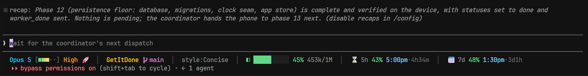

# claude-code-statusline

A single-line status line for [Claude Code](https://claude.com/claude-code): model, effort, repo, context budget, and both rate-limit meters — in one row, with no dependencies beyond the Node that ships with Claude Code.



Reading that line left to right:

| Segment | Meaning |
| --- | --- |
| `Opus 5 [■■■··] High 🚀` | Model, the effort gauge (cool → hot across five levels), and whether extended thinking is on (`🚀`) or off (`💤`) |
| `GetItDone  main` | Current directory, then the git branch |
| `style:Concise` | Active output style, hidden when it's `default` |
| `◧ █████░░░░░ 45% 453k/1M` | Context window: bar, percent used, tokens in / window size |
| `⏳ 5h 43% 5:00pm·4h34m` | 5-hour rate limit: percent used, when it resets, time until |
| `📅 7d 48% 1:30pm·3d1h` | 7-day rate limit, same shape |

Segments appear only when Claude Code sends the data for them, so the line stays short in a plain directory and grows when there's something to say. Subagent name, vim mode, and fast mode (`⚡`) show up the same way.

## Requirements

- Claude Code (any recent version — the status line reads its JSON payload on stdin)
- Node.js — already present if you installed Claude Code via npm
- A terminal with 256-color support (essentially all of them) and, for the branch glyph, a [Nerd Font](https://www.nerdfonts.com/). No Nerd Font? See [Fonts and glyphs](#fonts-and-glyphs).

Windows, macOS, and Linux are all supported. Git is optional; without it the repo segment is simply omitted.

## Install

```bash
git clone https://github.com/<you>/claude-code-statusline.git
cd claude-code-statusline
node install.js
```

The installer copies `statusline.js` to `~/.claude/statusline-command.js` and points the `statusLine` key in `~/.claude/settings.json` at it, backing up your existing settings first. Restart Claude Code to see the result.

```bash
node install.js --print                 # show what it would do, change nothing
node install.js --dir ~/.claude-work    # install into a second Claude profile
```

### By hand

Copy `statusline.js` anywhere you like, then add this to `~/.claude/settings.json`:

```json
{
  "statusLine": {
    "type": "command",
    "command": "node /absolute/path/to/statusline.js"
  }
}
```

Use forward slashes in the path on Windows too.

## Try it without installing

```bash
node tools/preview.js          # one line, using your current directory and live clock
node tools/preview.js --all    # every effort level, plus a near-the-limit line
node tools/preview.js --ctx 92 # force a context percentage to see the red threshold
```

`docs/example-input.json` shows the JSON payload Claude Code pipes in, if you want to feed the script by hand:

```bash
node statusline.js < docs/example-input.json
```

## Configuration

Everything is configurable, and you never have to edit `statusline.js` to do it. Drop a `~/.claude/statusline-config.json` next to your settings — it is deep-merged over the defaults, so include only the keys you want to change. Start from `statusline-config.example.json`.

```json
{
  "bar": { "width": 14 },
  "timeFormat": "h24",
  "showWorktree": true,
  "icons": { "git": "⎇" }
}
```

### The knobs

**Context bar** — `bar.width` (cells), `bar.filled` / `bar.empty` (glyphs), `bar.show` (set `false` to drop the bar and keep the percentage).

**Colors** — every color is a [256-color code](https://www.ditig.com/256-colors-cheat-sheet). `colors.{model,dir,git,worktree,agent,label,sep,reset,fast}` set the fixed ones. `ctxThresholds` and `limitThresholds` are top-down lists of `{ at, color }`; the first entry whose `at` the percentage reaches wins, so keep them sorted high to low. Context goes red at 80% by default; the limit meters warm through three shades from 50% up.

**Effort display** — `effortStyle` picks the presentation:

| Value | Looks like |
| --- | --- |
| `bar` (default) | `[■■■··] High` — a stepped gauge with a cool→hot ramp |
| `text` | `High` — bold, colored, no fill |
| `chip-loud` | Plain text for low/med/high, a filled chip for xhigh/max |
| `chip` | A filled chip at every level |

Under `effortBar`: `filled` / `empty` glyphs, `cellsPerLevel` (widen the meter — `2` gives ten cells), `brackets` (`null` to remove the frame), `ramp` (the color ramp, sampled across the strip; `null` for a flat fill), `showLabel`, `rampLabel` (color the word with the hottest lit cell), and `showMark` (prefix `▲` at xhigh/max). Per-level names and colors live in `effortStyles`.

Run `node tools/effort-gallery.js` to see the variants side by side in your own terminal before you pick one.

**Git worktrees** — `showWorktree: true` appends `(⑂ name)` after the branch when you're in a linked worktree. `worktreeLabel` chooses what that name is: `auto` (the worktree folder, or the parent repo when that would just repeat the directory segment to its left), `name`, or `repo`. Off by default, since the directory segment usually already tells you.

**Clocks** — `timeFormat` is `h12` or `h24`; `showResetCountdown: false` drops the `·4h34m` tail after each reset time.

**Layout** — `showSeparators: false` joins segments with plain spaces; `separator` changes the `│`.

**Icons** — `icons.{thinkingOn,thinkingOff,fast,ctx,fiveHour,sevenDay,resets,git,worktree}`.

### Fonts and glyphs

The branch glyph `` is a Nerd Font character. If it renders as a box, either install a Nerd Font or pick a fallback:

```json
{ "icons": { "git": "⎇" } }
```

Setting `icons.git` to `""` switches the branch to a plain `(main)`. The same applies to any emoji in the line — replace them with ASCII if your terminal is unhappy: `{ "icons": { "fiveHour": "5h", "sevenDay": "7d", "thinkingOn": "*", "thinkingOff": "-" } }`.

## How it works

Claude Code runs the `statusLine` command on each render and pipes a JSON blob to stdin describing the session; whatever the command writes to stdout becomes the status line. This script parses that blob, builds the segments it has data for, and prints one line of ANSI-colored text.

The only external command it runs is a single `git rev-parse` per render, invoked with `GIT_OPTIONAL_LOCKS=0` and asking for four values at once — so it never blocks on an index lock and never adds a second process to the render path. If git isn't installed, isn't on `PATH`, or the directory isn't a repo, the call fails silently and the segment is dropped.

## Repo layout

```
statusline.js                    the status line itself — the only file you need
install.js                       copies it into place and wires up settings.json
statusline-config.example.json   annotated starting point for your overrides
docs/example-input.json          the payload Claude Code sends, for manual testing
tools/preview.js                 render the line with plausible fake data
tools/effort-gallery.js          side-by-side gallery of effort-display styles
tools/statusline.sh              earlier bash + jq implementation, kept for reference
```

The bash version in `tools/` predates the Node one and gets no new features — it's there for anyone who'd rather extend a shell script and has `jq` around.

## Troubleshooting

**Nothing shows up.** Check that `statusLine.command` in `~/.claude/settings.json` is an absolute path with forward slashes, and that `node` resolves on your `PATH`. Then run the command by hand: `node ~/.claude/statusline-command.js < docs/example-input.json`.

**The line renders but a segment is missing.** Segments are omitted when their data is absent. The rate-limit meters need a plan that reports usage; the style segment hides itself on `default`; the worktree marker is off unless you turn it on.

**Colors look wrong or escape codes are visible.** Your terminal isn't interpreting 256-color SGR sequences. Most terminals do; some CI and logging contexts don't.

**Edits to `statusline.js` in this repo change nothing.** The installed copy lives at `~/.claude/statusline-command.js`. Re-run `node install.js` after editing, or point `settings.json` directly at your clone.

## License

MIT — see [LICENSE](LICENSE).
